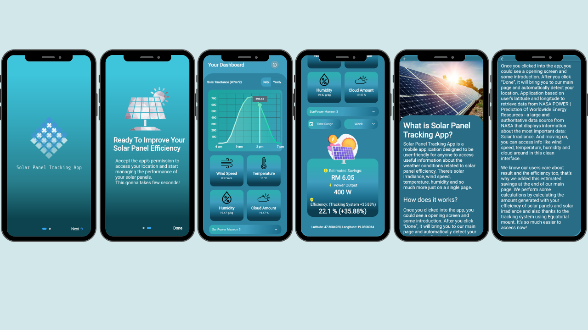

# yettel_hackathon_2022
Project about solving "Energy efficiency in office and home" challenge
# Solar Panel Tracking System

## High Level Summary 
- The Earth intercepts a lot of solar power, 173 thousand terawatts,  however, a lot of useful information associated with solar energy is not commonly known by the general public, especially homeowners. Hence, this is why we created a new system which is a combination of a equatorial mount for tracking the sun and the solar panel tracking mobile application that simplifies NASA’s data in dashboard that allows homeowners to easily gain access to meteorological data, monitor the electrical output, estimate future electrical savings, and so on.
## How does it work?
- Our system performance is significantly improved based on these two improvements.
- The principle is simple: the Earth rotates around an axis (counter-clockwise in the Northern hemisphere, and clockwise in the Southern hemisphere). If the mount is aligned along this axis, and if it rotates at the same speed as Earth (about 1 revolution every 24 hours) but in the opposite direction, then the movement of the Earth and that of the equatorial mount cancel each other. In other words, the mount will be able to track the sun, and if you attach a solar panel to the mount, the sun will shine as fixed to the solar panel maximizes solar panel efficiency.
- Moreover, your solar panel system performance is optimized thanks to our Solar Panel Tracking App, once you clicked into the app, you could see a opening screen and some introduction. After you click “Done”, it will bring you to our main page and automatically detect your location. Application based on user's latitude and longitude to retrieve data from NASA POWER - Prediction Of Worldwide Energy Resources - a large and authoritative data source from NASA that displays information about the most important data: Solar Irradiance. And moving on, you can access info like wind speed, temperature, humidity and cloud around in this clean interface. From there the application calculates for you the percentage of performance that the entire system bring to you.
## Problems we solved?
- For only the fixed installation, the quantity of the global irradiation is 2147.19 kWh/m2, while with a biaxial equatorial tracking system, we will have 2917.65 kWh/m2 (an increase of 35.88%). And based on a mobile application the performance of the system can be improved by more than 20%.
- Our app aims to motivate people and companies to save energy and reduce energy consumption at homes and in the offices. And also support municipalities, industries and organizations to save energy and transition to green energy, especially to solve the problem of gas and heating - one of Europe's important problems today.
## Data Source
- NASA POWER API service - To get all the data we need to be displayed in the app.
## References
- https://doi.org/10.1155/2021/6679576 (Biaxial Equatorial Solar Tracker with High Precision and Low Consumption: Modelling and Realization).
## Coding Languages
- Flutter.
- Dart.

